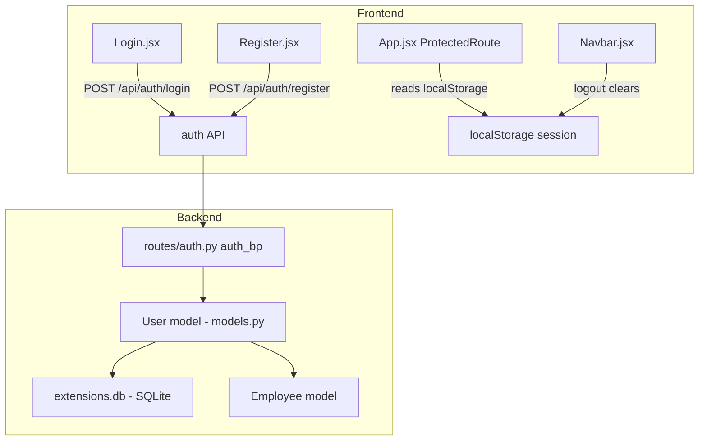

# Design Document: User Authentication

## Overview

This document describes the technical design for adding an authentication system to the OnboardAI employee onboarding tracker. The system introduces a `User` model with two roles (`admin` and `employee`), a login/register API, localStorage-based session management on the frontend, and route protection via a `ProtectedRoute` component.

The design integrates cleanly with the existing Flask app factory pattern, SQLAlchemy setup via `extensions.py`, and React Router v6 frontend. No JWT tokens are used — auth state is a simple object stored in `localStorage`.

---

## Architecture



**Request flow — login:**
1. User submits email + password on `Login.jsx`
2. Frontend calls `POST /api/auth/login`
3. `auth_bp` looks up the `User` by email, verifies password hash
4. On success, returns `{ userId, email, role, employeeId }`
5. Frontend stores these four keys in `localStorage` and redirects

**Route protection flow:**
1. `App.jsx` wraps protected routes in `<ProtectedRoute>`
2. `ProtectedRoute` reads `localStorage` on render
3. If no session → redirect to `/login`
4. If employee role on admin route → redirect to `/employee/:employeeId`
5. Otherwise → render the child component

---

## Components and Interfaces

### Backend

#### `backend/models.py` — User model

Added alongside existing `Employee` and `Task` models. Imports `db` from `extensions`.

```python
class User(db.Model):
    __tablename__ = 'users'
    id            = db.Column(db.Integer, primary_key=True)
    email         = db.Column(db.String(120), unique=True, nullable=False)
    password_hash = db.Column(db.String(256), nullable=False)
    role          = db.Column(db.String(20), nullable=False)   # "admin" | "employee"
    employee_id   = db.Column(db.Integer, db.ForeignKey('employees.id'), nullable=True)
```

#### `backend/routes/auth.py` — auth_bp Blueprint

```
Blueprint name : auth_bp
URL prefix     : /api/auth

POST /api/auth/login
  Body   : { email, password }
  200    : { userId, email, role, employeeId }
  400    : missing fields
  401    : bad credentials

POST /api/auth/register
  Body   : { email, password, role, employee_id? }
  201    : { userId, email, role, employeeId }
  400    : missing fields / invalid role / employee role without valid employee_id
  409    : duplicate email
```

#### `backend/app.py` — blueprint registration

```python
from routes.auth import auth_bp
app.register_blueprint(auth_bp)
```

#### `backend/db_init.py` — seeding

Extended to create:
- One admin user: `admin@company.com` / `admin123`
- One employee user per seeded `Employee`, using the employee's email and password `employee123`
- Skip-if-exists guard to make seeding idempotent

### Frontend

#### `frontend/src/api/index.js` — new auth helpers

```js
export const login    = (data) => api.post('/api/auth/login', data).then(r => r.data)
export const register = (data) => api.post('/api/auth/register', data).then(r => r.data)
```

#### `frontend/src/pages/Login.jsx`

- Email + password form
- On success: writes `{ role, userId, employeeId }` to `localStorage`, redirects
  - `admin` → `/`
  - `employee` → `/employee/:employeeId`
- On error: shows error message, preserves email field
- If already authenticated: redirects immediately (no re-render of form)

#### `frontend/src/pages/Register.jsx`

- Email, password, role, optional employee_id form
- On success: shows success message, redirects to `/login`
- On error: shows error message

#### `frontend/src/App.jsx` — ProtectedRoute

```jsx
function ProtectedRoute({ adminOnly, children }) {
  const role       = localStorage.getItem('role')
  const employeeId = localStorage.getItem('employeeId')

  if (!role) return <Navigate to="/login" replace />
  if (adminOnly && role === 'employee')
    return <Navigate to={`/employee/${employeeId}`} replace />
  return children
}
```

Routes:
```jsx
<Route path="/login"    element={<Login />} />
<Route path="/register" element={<Register />} />
<Route path="/"         element={<ProtectedRoute adminOnly><Dashboard /></ProtectedRoute>} />
<Route path="/admin"    element={<ProtectedRoute adminOnly><AdminPanel /></ProtectedRoute>} />
<Route path="/employee/:id" element={<ProtectedRoute><EmployeeDetail /></ProtectedRoute>} />
```

#### `frontend/src/components/Navbar.jsx` — logout

Adds a Logout button that:
1. Removes `role`, `userId`, `employeeId` from `localStorage`
2. Navigates to `/login`

---

## Data Models

### `users` table

| Column          | Type         | Constraints                              |
|-----------------|--------------|------------------------------------------|
| `id`            | INTEGER      | PRIMARY KEY, AUTOINCREMENT               |
| `email`         | VARCHAR(120) | UNIQUE, NOT NULL                         |
| `password_hash` | VARCHAR(256) | NOT NULL                                 |
| `role`          | VARCHAR(20)  | NOT NULL — `"admin"` or `"employee"`     |
| `employee_id`   | INTEGER      | NULLABLE, FK → `employees.id`            |

**Constraints enforced at application layer:**
- `role` must be one of `"admin"` or `"employee"`
- When `role = "employee"`, `employee_id` must reference an existing `Employee`
- When `role = "admin"`, `employee_id` may be `NULL`

### localStorage session shape

```json
{
  "role":       "admin" | "employee",
  "userId":     "42",
  "employeeId": "7" | null
}
```

All values stored as strings (standard `localStorage` behavior). `employeeId` is `"null"` string or absent for admin users.

---

## Correctness Properties

*A property is a characteristic or behavior that should hold true across all valid executions of a system — essentially, a formal statement about what the system should do. Properties serve as the bridge between human-readable specifications and machine-verifiable correctness guarantees.*

### Property 1: Password hashing round-trip

*For any* plaintext password string, hashing it with `generate_password_hash` and then verifying with `check_password_hash` SHALL return `True`, and the stored hash SHALL NOT equal the original plaintext.

**Validates: Requirements 2.1, 2.2**

---

### Property 2: Plaintext password never appears in API response

*For any* password used during registration or login, the raw plaintext password string SHALL NOT appear anywhere in the JSON response body returned by the login or register endpoint.

**Validates: Requirements 2.3**

---

### Property 3: Login with valid credentials returns correct user data

*For any* registered user (any role, any email), submitting their correct email and password to `POST /api/auth/login` SHALL return HTTP 200 with a JSON body containing the correct `userId`, `email`, `role`, and `employeeId` values for that user.

**Validates: Requirements 3.1**

---

### Property 4: Login with invalid credentials returns 401

*For any* combination of (a) an email not present in the database, or (b) a registered email paired with an incorrect password, `POST /api/auth/login` SHALL return HTTP 401.

**Validates: Requirements 3.2, 3.3**

---

### Property 5: Registration with valid data creates user and returns correct fields

*For any* unique email, non-empty password, valid role, and (when role is `"employee"`) a valid `employee_id`, `POST /api/auth/register` SHALL return HTTP 201 with `userId`, `email`, `role`, and `employeeId` matching the submitted data, and the user SHALL exist in the database.

**Validates: Requirements 4.1**

---

### Property 6: Duplicate email registration returns 409

*For any* email that is already registered, a second `POST /api/auth/register` request using that same email SHALL return HTTP 409 regardless of the other fields provided.

**Validates: Requirements 4.2**

---

### Property 7: Invalid role value returns 400

*For any* role string that is not exactly `"admin"` or `"employee"`, `POST /api/auth/register` SHALL return HTTP 400.

**Validates: Requirements 4.3**

---

### Property 8: Employee role without valid employee_id returns 400

*For any* registration request with `role = "employee"` and a missing, null, or non-existent `employee_id`, `POST /api/auth/register` SHALL return HTTP 400.

**Validates: Requirements 1.2, 4.4**

---

### Property 9: Every seeded employee has a corresponding user

*For any* set of `Employee` records created by the seed script, every employee SHALL have exactly one corresponding `User` record with `role = "employee"`, `email` matching the employee's email, and a valid `employee_id` pointing to that employee.

**Validates: Requirements 6.2**

---

### Property 10: Seed is idempotent

*For any* database state after an initial seed run, running the seed script a second time SHALL NOT increase the total number of `User` records — duplicate emails are silently skipped.

**Validates: Requirements 6.3**

---

### Property 11: Login stores correct data in localStorage

*For any* authenticated user (any role, any userId, any employeeId), after a successful login the values stored in `localStorage` for `role`, `userId`, and `employeeId` SHALL exactly match the values returned by the login API response.

**Validates: Requirements 7.2**

---

### Property 12: Employee user redirected to their own detail page after login

*For any* employee user with any `employeeId`, after a successful login the application SHALL navigate to `/employee/{employeeId}` where `{employeeId}` matches the value returned by the login API.

**Validates: Requirements 7.4**

---

### Property 13: Unauthenticated user redirected to /login on protected routes

*For any* route that is not `/login` or `/register`, when no auth session exists in `localStorage`, the `ProtectedRoute` component SHALL redirect the user to `/login`.

**Validates: Requirements 9.1**

---

### Property 14: Employee user redirected away from admin routes

*For any* employee user (any `employeeId`), navigating to `/` or `/admin` SHALL redirect them to `/employee/{employeeId}` rather than rendering the admin-only page.

**Validates: Requirements 9.2**

---

### Property 15: Logout clears all auth keys from localStorage

*For any* authenticated session (any role, any userId, any employeeId), triggering logout SHALL result in `localStorage` containing neither `role`, `userId`, nor `employeeId`.

**Validates: Requirements 10.1**

---

## Error Handling

### Backend

| Scenario | HTTP Status | Response body |
|---|---|---|
| Missing `email` or `password` in login | 400 | `{ "error": "email and password are required" }` |
| Email not found | 401 | `{ "error": "invalid credentials" }` |
| Password mismatch | 401 | `{ "error": "invalid credentials" }` |
| Missing required register field | 400 | `{ "error": "<field> is required" }` |
| Invalid role value | 400 | `{ "error": "role must be admin or employee" }` |
| Employee role without valid employee_id | 400 | `{ "error": "valid employee_id is required for employee role" }` |
| Duplicate email | 409 | `{ "error": "email already registered" }` |

**Design decision:** Login returns the same 401 message for both "email not found" and "wrong password" to avoid user enumeration.

### Frontend

- Login errors: displayed inline below the form; email field is preserved, password field is cleared
- Register errors: displayed inline; form fields preserved
- Network errors: caught in `try/catch`, displayed as generic error message
- `ProtectedRoute` redirects are synchronous on render — no flash of protected content

---

## Testing Strategy

### Unit / Example-based tests (pytest + Flask test client)

Focus on specific scenarios and edge cases:

- Login with missing fields → 400
- Register with missing fields → 400
- Admin user creation with null employee_id → succeeds
- Admin login → correct redirect behavior
- Logout → localStorage cleared, redirect to `/login`
- Register success → redirect to `/login`

### Property-based tests (Hypothesis — Python)

Used for the backend logic layer where input variation reveals bugs. Each property test runs a minimum of 100 iterations.

**Library:** `hypothesis` (already available in the Python ecosystem; add to `requirements.txt`)

Property tests are tagged with comments in the format:
`# Feature: user-authentication, Property {N}: {property_text}`

Properties covered by Hypothesis tests:
- **P1** — Password hashing round-trip
- **P2** — Plaintext password never in API response
- **P3** — Login with valid credentials returns correct data
- **P4** — Login with invalid credentials returns 401
- **P5** — Registration with valid data creates user
- **P6** — Duplicate email returns 409
- **P7** — Invalid role returns 400
- **P8** — Employee role without employee_id returns 400
- **P9** — Every seeded employee has a user
- **P10** — Seed idempotence

### Frontend tests (Vitest + React Testing Library)

Frontend properties (P11–P15) are tested using Vitest with `localStorage` mocked:

- **P11** — Login stores correct localStorage data
- **P12** — Employee redirect to `/employee/:id`
- **P13** — Unauthenticated redirect to `/login`
- **P14** — Employee redirect away from admin routes
- **P15** — Logout clears localStorage

Frontend unit tests cover:
- Login error display (email preserved, error shown)
- Register success/error display
- Navbar logout button presence
- Admin user unrestricted access (Req 9.3)
